# สถาปัตยกรรม ESP32
## โครงสร้างระบบ 

    

**แผนภาพบล็อกสถาปัตยกรรม ESP32**  

### **Dual-Core Architecture: PRO_CPU และ APP_CPU**

ESP32 มี **หน่วยประมวลผลแบบ Dual-Core** ที่ประกอบด้วย:

#### **PRO_CPU (Protocol CPU - Core 0)**
- **หน้าที่หลัก**: จัดการ **Network Protocols** และ **Wireless Communications**
- **งานที่รับผิดชอบ**:
  - **Wi-Fi Protocol Stack**: การจัดการ Wi-Fi connection, packet processing
  - **Bluetooth Protocol Stack**: การจัดการ Bluetooth Classic และ BLE
  - **TCP/IP Stack**: การประมวลผล network protocols
  - **Security Processing**: การเข้ารหัส/ถอดรหัสข้อมูลสื่อสาร
  - **Real-time Network Tasks**: งานที่ต้องการความแม่นยำด้านเวลา
- **คุณสมบัติพิเศษ**:
  - มี **Hardware Accelerators** สำหรับ cryptographic operations
  - **Interrupt Priority** สูงสำหรับ network events
  - **Dedicated Memory Access** สำหรับ protocol buffers

#### **APP_CPU (Application CPU - Core 1)**
- **หน้าที่หลัก**: ประมวลผล **User Applications** และ **Main Program Logic**
- **งานที่รับผิดชอบ**:
  - **User Application Code**: โปรแกรมที่ผู้ใช้เขียน
  - **Sensor Data Processing**: การประมวลผลข้อมูลจากเซ็นเซอร์
  - **Control Logic**: การควบคุมอุปกรณ์และการตัดสินใจ
  - **File System Operations**: การจัดการไฟล์และข้อมูล
  - **User Interface**: การจัดการ display และ user interaction
- **คุณสมบัติพิเศษ**:
  - **Full Access** ไปยัง peripherals ทั้งหมด
  - **Floating Point Unit (FPU)** สำหรับการคำนวณทางคณิตศาสตร์
  - **Flexible Task Scheduling** สำหรับ multitasking

### **การทำงานร่วมกันของ Dual-Core**

```mermaid
graph LR
    PRO["PRO_CPU<br/>(Core 0)<br/>🌐 Protocol"]
    APP["APP_CPU<br/>(Core 1)<br/>📱 Application"]
    
    Memory["Shared Memory<br/>💾"]
    Queue["Inter-Core<br/>Communication<br/>📬"]
    
    PRO <--> Memory
    APP <--> Memory
    PRO <--> Queue
    APP <--> Queue
    
    WiFi["Wi-Fi<br/>📡"] --> PRO
    BT["Bluetooth<br/>📶"] --> PRO
    
    Sensors["Sensors<br/>🔬"] --> APP
    Control["Control Logic<br/>⚙️"] --> APP
    
    style PRO fill:#e1f5fe
    style APP fill:#f3e5f5
    style Memory fill:#fff3e0
    style Queue fill:#e8f5e8
```

### **ข้อดีของ Dual-Core Architecture**

#### **1. Task Isolation (การแยกงาน)**
- **Network Tasks** ไม่รบกวน **Application Tasks**
- การประมวลผล Wi-Fi/Bluetooth ไม่ทำให้ user application หยุดทำงาน
- **Real-time Performance** สำหรับทั้งสองส่วน

#### **2. Parallel Processing (การประมวลผลแบบขนาน)**
- ทำงานพร้อมกันได้ **240 MHz x 2 = 480 MHz** equivalent performance
- **Load Balancing**: กระจายภาระงานระหว่าง cores
- **Improved Responsiveness**: ระบบตอบสนองเร็วขึ้น

#### **3. Power Efficiency**
- สามารถ **power down** core ที่ไม่ใช้งาน
- **Dynamic Frequency Scaling** แต่ละ core แยกกัน
- **Sleep Modes** ที่ยืดหยุ่น

### **การใช้งานจริงในโปรเจค**

#### **ตัวอย่างการแบ่งงาน**:
- **PRO_CPU**: จัดการ Wi-Fi connection, MQTT communication, web server
- **APP_CPU**: อ่านเซ็นเซอร์, ประมวลผลข้อมูล, ควบคุม actuators, update display

สถาปัตยกรรม Dual-Core นี้ทำให้ ESP32 มีประสิทธิภาพสูงและเหมาะสำหรับ IoT applications ที่ต้องการทั้งการสื่อสารเครือข่ายและการประมวลผลในเครื่องพร้อมกัน

## ภาพรวมสถาปัตยกรรม ESP32

ESP32 เป็นไมโครคอนโทรลเลอร์ที่มีสถาปัตยกรรมที่ทันสมัยและทรงพลัง ประกอบด้วยส่วนประกอบหลักดังนี้:

### 1. **CPU Core (หน่วยประมวลผลหลัก)**

```mermaid
graph TB
    subgraph ESP32["ESP32 Dual-Core CPU"]
        subgraph Core0["PRO_CPU (Core 0)"]
            CPU0["Xtensa LX6<br/>⚡ 240 MHz"]
            Cache0["L1 Cache<br/>💾"]
        end
        
        subgraph Core1["APP_CPU (Core 1)"]
            CPU1["Xtensa LX6<br/>⚡ 240 MHz"]
            Cache1["L1 Cache<br/>💾"]
        end
        
        L2Cache["L2 Shared Cache<br/>💾 16KB"]
        CrossBar["Crossbar Interconnect<br/>🔄"]
        
        CPU0 --> Cache0
        CPU1 --> Cache1
        Cache0 --> L2Cache
        Cache1 --> L2Cache
        CPU0 --> CrossBar
        CPU1 --> CrossBar
    end
    
    style Core0 fill:#e3f2fd
    style Core1 fill:#f3e5f5
    style L2Cache fill:#fff3e0
    style CrossBar fill:#e8f5e8
```

#### **คุณสมบัติหลัก**
- **Dual-Core Xtensa LX6 32-bit Processors** ความเร็วสูงสุด 240 MHz
- **Floating Point Unit (FPU)** สำหรับการคำนวณทางคณิตศาสตร์
- **Memory Management Unit (MMU)** จัดการหน่วยความจำ
- **Cache System** L1 และ L2 cache เพิ่มประสิทธิภาพ
- **Interrupt Controller** จัดการ interrupts แยกต่างหาก

## รายละเอียด CPU Core Architecture

#### **คุณสมบัติเฉพาะของ CPU Cores**

##### **Xtensa LX6 32-bit Architecture**
- **RISC-based**: Reduced Instruction Set Computer
- **Harvard Architecture**: แยก instruction และ data memory
- **Pipeline**: 5-stage instruction pipeline
- **Branch Prediction**: เพิ่มประสิทธิภาพการทำงาน
- **Variable Length Instructions**: 16-bit และ 24-bit instructions

##### **Floating Point Unit (FPU)**
- **IEEE 754 Compatible**: มาตรฐาน floating point
- **Single Precision**: 32-bit floating point operations
- **Hardware Acceleration**: การคำนวณเร็วกว่า software emulation
- **Mathematical Functions**: sin, cos, sqrt, etc.

##### **Memory Management Unit (MMU)**
- **Virtual Memory**: การจัดการ virtual address space
- **Memory Protection**: ป้องกันการเข้าถึงหน่วยความจำผิดพื้นที่
- **Page Tables**: การแบ่งหน่วยความจำเป็น pages
- **Address Translation**: แปลง virtual เป็น physical address

##### **Cache System**
- **L1 Instruction Cache**: 16 KB per core
- **L1 Data Cache**: 16 KB per core  
- **L2 Shared Cache**: 16 KB ใช้ร่วมกัน
- **4-way Set Associative**: เพิ่มประสิทธิภาพ cache hit
- **Write-back Policy**: ลดการเขียนไปยัง main memory

##### **Interrupt System**
- **32 Interrupt Levels**: ระดับ priority ต่างๆ
- **Vectored Interrupts**: jump ไปยัง handler โดยตรง
- **Interrupt Nesting**: รองรับ interrupt ซ้อนกัน
- **Per-core Interrupts**: แต่ละ core มี interrupt controller

#### **Core Synchronization และ Communication**
- **Spinlocks**: การ lock ระหว่าง cores
- **Semaphores**: การซิงโครไนซ์ tasks
- **Message Queues**: การส่งข้อมูลระหว่าง cores
- **Shared Memory**: หน่วยความจำที่ใช้ร่วมกัน

### 2. **Memory System (ระบบหน่วยความจำ)**

**รายละเอียดหน่วยความจำ:**

- **Internal SRAM**: 520 KB
  - 448 KB สำหรับ Data และ Instructions
  - 72 KB สำหรับ Cache
- **External Flash Memory**: สูงสุด 16 MB
- **External PSRAM**: สูงสุด 8 MB (ตัวเลือก)
- **RTC Memory**: 8 KB สำหรับ Real-Time Clock

### 3. **Wireless Connectivity (การเชื่อมต่อไร้สาย)**

```mermaid
graph LR
    subgraph ESP32["ESP32 Wireless System"]
        subgraph Cores["Dual-Core CPU"]
            PRO["PRO_CPU<br/>� Protocol"]
            APP["APP_CPU<br/>📱 Application"]
        end
        
        subgraph Wireless["Wireless Hardware"]
            WiFi["Wi-Fi<br/>802.11 b/g/n<br/>"]
            BT["Bluetooth 4.2<br/>Classic + BLE<br/>�"]
            RF["RF Frontend<br/>2.4 GHz<br/>�"]
        end
        
        subgraph Network["Network Stack"]
            TCP["TCP/IP<br/>🌐"]
            Security["Security<br/>WPA3/AES<br/>�"]
            Protocols["App Protocols<br/>HTTP/MQTT<br/>📨"]
        end
    end
    
    subgraph External["External Devices"]
        Router["Wi-Fi Router<br/>�"]
        Internet["Internet<br/>🌍"]
        Phone["Smartphone<br/>📱"]
        IoT["IoT Devices<br/>⚡"]
    end
    
    %% Main connections
    PRO --> WiFi
    PRO --> BT
    APP --> Network
    
    WiFi --> RF
    BT --> RF
    WiFi --> TCP
    
    TCP --> Security
    Security --> Protocols
    
    %% External connections
    RF -.->|Wi-Fi| Router
    Router -.-> Internet
    RF -.->|Bluetooth| Phone
    RF -.->|BLE| IoT
    
    %% Styling
    style PRO fill:#e3f2fd
    style APP fill:#f3e5f5
    style WiFi fill:#e8f5e8
    style BT fill:#fff3e0
    style RF fill:#fce4ec
    style TCP fill:#f1f8e9
    style Security fill:#ffebee
    style Protocols fill:#e0f2f1
```

**รายละเอียดการเชื่อมต่อไร้สาย:**

- **Wi-Fi 802.11 b/g/n**
  - Station mode และ Access Point mode
  - Wi-Fi Direct และ SoftAP
  - WPA/WPA2/WPA3 Security
- **Bluetooth v4.2 BR/EDR และ BLE**
  - Classic Bluetooth และ Low Energy
  - รองรับ Mesh networking

### 4. **Peripheral Interfaces (อินเทอร์เฟซต่อพ่วง)**

```mermaid
graph LR
    subgraph ESP32["ESP32 Peripherals"]
        CPU["Dual Core<br/>CPU<br/>⚡"]
        
        subgraph Communication["Communication"]
            UART["UART<br/>3 ports<br/>📡"]
            SPI["SPI<br/>4 ports<br/>🔄"]
            I2C["I2C<br/>2 ports<br/>🔗"]
            I2S["I2S<br/>Audio<br/>🎵"]
            CAN["CAN 2.0<br/>Vehicle<br/>🚗"]
        end
        
        subgraph Analog["Analog"]
            ADC["ADC<br/>18 channels<br/>📈"]
            DAC["DAC<br/>2 channels<br/>📉"]
            Touch["Touch<br/>10 pins<br/>👆"]
            Hall["Hall Sensor<br/>Magnetic<br/>🧲"]
        end
        
        subgraph Digital["Digital I/O"]
            GPIO["GPIO<br/>34 pins<br/>🔌"]
            PWM["PWM<br/>16 channels<br/>〰️"]
            LED["LED PWM<br/>Control<br/>💡"]
        end
        
        subgraph Timers["Timers"]
            Timer["Timer Groups<br/>2 groups<br/>⏰"]
            WDT["Watchdog<br/>2 timers<br/>🐕"]
            RTC_Timer["RTC Timer<br/>Real-time<br/>🕐"]
        end
    end
    
    CPU --> Communication
    CPU --> Analog
    CPU --> Digital
    CPU --> Timers
    
    style CPU fill:#e1f5fe
    style Communication fill:#f3e5f5
    style Analog fill:#fff3e0
    style Digital fill:#e8f5e8
    style Timers fill:#fce4ec
```

**รายละเอียด Peripherals:**

- **GPIO**: 34 pins โปรแกรมได้
- **ADC**: 12-bit, 18 channels
- **DAC**: 8-bit, 2 channels
- **PWM**: 16 channels
- **Communication Interfaces**:
  - UART: 3 ports
  - SPI: 4 ports (2 สำหรับ Flash)
  - I2C: 2 ports
  - I2S: 2 ports สำหรับเสียงดิจิทัล
  - CAN 2.0: 1 port
- **Touch Sensor**: 10 capacitive touch pins
- **Hall Effect Sensor**: ตัวตรวจจับสนามแม่เหล็ก

### 5. **Security Features (คุณสมบัติด้านความปลอดภัย)**
- **Hardware Security**:
  - Secure Boot
  - Flash Encryption
  - Hardware Random Number Generator
  - Cryptographic Hardware Accelerators (AES, SHA, RSA)
- **Digital Signature และ HMAC**

### 6. **Power Management (การจัดการพลังงาน)**

**รายละเอียดโหมดพลังงาน:**

- **Ultra-Low Power (ULP) Co-processor**
- **โหมดการทำงาน**:
  - Active mode: ~240 mA
  - Modem sleep: ~20 mA
  - Light sleep: ~0.8 mA
  - Deep sleep: ~10 µA
  - Hibernation: ~2.5 µA

### 7. **Clock System (ระบบสัญญาณนาฬิกา)**
- **External Crystal**: 40 MHz
- **Internal RC Oscillator**: 8 MHz
- **PLL**: Phase-Locked Loop สำหรับปรับความถี่
- **RTC Clock**: 32.768 kHz สำหรับ Real-Time Clock

### 8. **Reset และ Boot System**

```mermaid
graph TD
    Start["Power On<br/>Reset<br/>🔌"]
    
    ROM["Boot ROM<br/>First Stage<br/>🔒"]
    
    Check["Check Boot Mode<br/>Pin Configuration<br/>🔍"]
    
    Flash_Boot["Flash Boot<br/>Normal Operation<br/>💾"]
    
    Download["Download Mode<br/>UART Programming<br/>📥"]
    
    Bootloader["Second Stage<br/>Bootloader<br/>⚙️"]
    
    Partition["Check Partition<br/>Table<br/>📋"]
    
    App["Load Application<br/>Start FreeRTOS<br/>🚀"]
    
    Start --> ROM
    ROM --> Check
    Check -->|Normal| Flash_Boot
    Check -->|Download| Download
    Flash_Boot --> Bootloader
    Bootloader --> Partition
    Partition --> App
    
    Download -.->|Program Flash| Flash_Boot
    
    style Start fill:#ffcdd2
    style ROM fill:#f8bbd9
    style Check fill:#e1bee7
    style Flash_Boot fill:#c5cae9
    style Download fill:#bbdefb
    style Bootloader fill:#b3e5fc
    style Partition fill:#b2ebf2
    style App fill:#b2dfdb
```

**รายละเอียด Boot System:**

- **Reset Sources**: Power-on, External, Watchdog, Software
- **Boot Modes**: Flash, UART Download, SD Card
- **Watchdog Timers**: 2 timers สำหรับความปลอดภัย

## ข้อดีของสถาปัตยกรรม ESP32

### ประสิทธิภาพ
- Dual-core ทำงานแบบ parallel processing
- หน่วยความจำเพียงพอสำหรับ applications ที่ซับซ้อน
- Cache memory เพิ่มความเร็วในการเข้าถึงข้อมูล

### การเชื่อมต่อ
- Wi-Fi และ Bluetooth ในชิปเดียว
- รองรับโปรโตคอลการสื่อสารหลายแบบ
- เหมาะสำหรับ IoT applications

### ประหยัดพลังงาน
- โหมดประหยัดพลังงานหลายระดับ
- ULP co-processor สำหรับงานขณะ sleep
- Power gating และ Clock gating

### ความปลอดภัย
- Hardware-based security features
- Encryption และ authentication
- Secure boot process

### ความยืดหยุ่น
- GPIO pins โปรแกรมได้
- Peripheral มากมาย
- รองรับการพัฒนาด้วย multiple frameworks

## การประยุกต์ใช้งาน
- **IoT Devices**: Smart home, sensors, automation
- **Wearable Technology**: Smartwatches, fitness trackers
- **Industrial Control**: Automation, monitoring systems
- **Audio Applications**: Bluetooth speakers, voice control
- **Camera Applications**: Security cameras, image processing

## System Address Mapping

    

```mermaid
graph LR
    subgraph AddressSpace["ESP32 32-bit Address Space"]
        BootROM["Boot ROM<br/>0x4000_0000<br/>32KB Read-Only<br/>🔒"]
        
        IRAM["IRAM<br/>0x4007_0000<br/>192KB Instructions<br/>⚡"]
        
        DRAM["DRAM<br/>0x3FFE_0000<br/>328KB Data/Variables<br/>📊"]
        
        Flash["External Flash<br/>0x4200_0000<br/>16MB Max Program<br/>💾"]
        
        PSRAM["External PSRAM<br/>0x3F80_0000<br/>8MB Max Extended RAM<br/>🔋"]
        
        RTC["RTC Memory<br/>0x5000_0000<br/>8KB Sleep Data<br/>🌙"]
        
        Peripheral["Peripherals<br/>0x3FF0_0000<br/>GPIO/UART/SPI<br/>🔧"]
    end
    
    style BootROM fill:#ffebee
    style IRAM fill:#f1f8e9
    style DRAM fill:#fff9c4
    style Flash fill:#fce4ec
    style PSRAM fill:#e0f2f1
    style RTC fill:#ffecf5
    style Peripheral fill:#e8f5e8
```

### การจัดการหน่วยความจำ ESP32

ESP32 ใช้ระบบ **Memory Mapping** แบบ 32-bit address space โดยแบ่งพื้นที่หน่วยความจำออกเป็นหลายส่วนตามการใช้งาน:

#### **1. Instruction Memory (IRAM)**
- **Address Range**: 0x4000_0000 - 0x4009_FFFF
- **ขนาด**: 640 KB
- **การใช้งาน**: เก็บ executable code ที่ต้องการความเร็วสูง
- **คุณสมบัติ**: Execute-only memory, ไม่สามารถ write ได้ขณะทำงาน

#### **2. Data Memory (DRAM)**
- **Address Range**: 0x3FFE_0000 - 0x3FFF_FFFF
- **ขนาด**: 128 KB
- **การใช้งาน**: เก็บ variables, heap, stack
- **คุณสมบัติ**: Read/Write memory สำหรับข้อมูลแบบ dynamic

#### **3. External Flash (Flash Memory)**
- **Address Range**: 0x4200_0000 - 0x42FF_FFFF
- **ขนาด**: สูงสุด 16 MB
- **การใช้งาน**: เก็บ application code, constants, file system
- **คุณสมบัติ**: Memory-mapped flash ผ่าน cache

#### **4. External PSRAM (Pseudo SRAM)**
- **Address Range**: 0x3F80_0000 - 0x3FBF_FFFF
- **ขนาด**: สูงสุด 8 MB (ถ้ามี)
- **การใช้งาน**: ขยายพื้นที่ RAM สำหรับ large applications
- **คุณสมบัติ**: Cached access ผ่าน MMU

#### **5. RTC Memory**
- **Address Range**: 0x5000_0000 - 0x5000_1FFF
- **ขนาด**: 8 KB
- **การใช้งาน**: เก็บข้อมูลที่ต้องการรักษาไว้ขณะ deep sleep
- **คุณสมบัติ**: Ultra-low power retention

#### **6. Peripheral Registers**
- **Address Range**: 0x3FF0_0000 - 0x3FFD_FFFF
- **การใช้งาน**: Control registers ของ peripheral ต่างๆ
- **คุณสมบัติ**: Memory-mapped I/O

### ข้อดีของ Memory Mapping System

#### **1. การจัดการหน่วยความจำอย่างมีประสิทธิภาพ**
- แยกพื้นที่ code และ data ชัดเจน
- Cache system เพิ่มความเร็วการเข้าถึง
- Memory protection ป้องกันการเข้าถึงผิดพื้นที่

#### **2. ความยืดหยุ่นในการพัฒนา**
- Memory-mapped I/O ทำให้เข้าถึง peripheral ง่าย
- Virtual memory ผ่าน MMU
- Dynamic memory allocation

#### **3. การใช้พลังงานอย่างชาญฉลาด**
- RTC memory สำหรับ data retention
- Power gating สำหรับส่วนที่ไม่ใช้งาน
- Selective memory refresh

## Advanced Features

```mermaid
graph TB
    subgraph ESP32_Advanced["ESP32 Advanced Features"]
        subgraph CPU_Cores["Dual CPU Cores"]
            Core0["PRO_CPU<br/>Core 0<br/>⚡"]
            Core1["APP_CPU<br/>Core 1<br/>📱"]
        end
        
        subgraph MMU_System["Memory Management Unit"]
            MMU["MMU<br/>Address Translation<br/>🗺️"]
            TLB["Translation<br/>Lookaside Buffer<br/>⚡"]
            MPU["Memory Protection<br/>Unit<br/>🛡️"]
        end
        
        subgraph Cache_Hierarchy["Cache Hierarchy"]
            L1_I["L1 I-Cache<br/>16KB each core<br/>📋"]
            L1_D["L1 D-Cache<br/>16KB each core<br/>💾"]
            L2["L2 Shared Cache<br/>16KB<br/>🔄"]
        end
        
        subgraph DMA_System["DMA Controllers"]
            DMA_Ch["13 DMA Channels<br/>🚚"]
            DMA_LL["Linked List Mode<br/>🔗"]
            DMA_Arb["DMA Arbitration<br/>⚖️"]
        end
        
        subgraph Memory_Types["Memory Types"]
            IRAM["IRAM<br/>Instructions<br/>⚡"]
            DRAM["DRAM<br/>Data<br/>📊"]
            Flash["Flash<br/>Storage<br/>💾"]
            PSRAM["PSRAM<br/>Extended<br/>🔋"]
        end
    end
    
    %% CPU to Cache connections
    Core0 --> L1_I
    Core0 --> L1_D
    Core1 --> L1_I
    Core1 --> L1_D
    L1_I --> L2
    L1_D --> L2
    
    %% MMU connections
    Core0 --> MMU
    Core1 --> MMU
    MMU --> TLB
    MMU --> MPU
    MMU --> Memory_Types
    
    %% Cache to Memory
    L2 --> IRAM
    L2 --> DRAM
    L2 --> Flash
    L2 --> PSRAM
    
    %% DMA connections
    DMA_Ch --> DMA_Arb
    DMA_LL --> DMA_Ch
    DMA_Arb --> Memory_Types
    
    %% Styling
    style Core0 fill:#e3f2fd
    style Core1 fill:#f3e5f5
    style MMU fill:#fff3e0
    style L2 fill:#e8f5e8
    style DMA_Ch fill:#fce4ec
    style IRAM fill:#f1f8e9
    style DRAM fill:#fff9c4
    style Flash fill:#ffebee
    style PSRAM fill:#e0f2f1
```

### **Memory Management Unit (MMU)**
ESP32 มี MMU ที่ช่วยในการ:
- **Virtual to Physical Address Translation**
- **Memory Protection**: ป้องกันการเข้าถึงพื้นที่ที่ไม่ได้รับอนุญาต
- **Cache Management**: จัดการ cache อย่างมีประสิทธิภาพ
- **Memory Fragmentation Handling**: จัดการการกระจายของหน่วยความจำ

### **Cache System**
- **Instruction Cache**: 16 KB สำหรับ instructions
- **Data Cache**: 16 KB สำหรับ data
- **Cache Coherency**: รักษาความสอดคล้องระหว่าง cores
- **Cache Bypass**: สำหรับ real-time applications

### **DMA (Direct Memory Access)**
- **13 DMA Channels**: สำหรับการถ่ายโอนข้อมูลโดยไม่ใช้ CPU
- **Linked List Mode**: สำหรับการถ่ายโอนข้อมูลต่อเนื่อง
- **Memory to Memory Transfer**: ถ่ายโอนระหว่างหน่วยความจำ
- **Peripheral to Memory Transfer**: ถ่ายโอนจาก peripheral เข้า memory

## การออกแบบและพัฒนา Applications

ESP32 มีกลยุทธ์การพัฒนาแอปพลิเคชันที่หลากหลาย ซึ่งสามารถแบ่งออกเป็น 4 หมวดหลัก:

### **1. Code Placement Strategy (กลยุทธ์การจัดวางโค้ด)**

```mermaid
graph TD
    subgraph CodeStrategy["ESP32 Code Placement"]
        Title["📋 Code Placement Strategy<br/>กลยุทธ์การจัดวางโค้ด"]
        
        Critical["⚡ Critical Code<br/>โค้ดสำคัญ<br/>→ IRAM<br/>(เร็วที่สุด)"]
        
        Normal["💾 Normal Code<br/>โค้ดทั่วไป<br/>→ Flash Memory<br/>(ประหยัดพื้นที่)"]
        
        Frequent["📊 Frequent Data<br/>ข้อมูลที่ใช้บ่อย<br/>→ DRAM<br/>(เข้าถึงเร็ว)"]
        
        Title --> Critical
        Title --> Normal
        Title --> Frequent
    end
    
    style Title fill:#e3f2fd
    style Critical fill:#ffcdd2
    style Normal fill:#f3e5f5
    style Frequent fill:#e8f5e8
```

**หลักการ Code Placement:**
- **IRAM (Internal RAM)**: สำหรับ interrupt handlers, critical timing functions
- **Flash Memory**: สำหรับ application code ทั่วไป, constants
- **DRAM (Data RAM)**: สำหรับ variables ที่เข้าถึงบ่อย, buffers

### **2. Data Management Strategy (กลยุทธ์การจัดการข้อมูล)**

```mermaid
graph TD
    subgraph DataStrategy["ESP32 Data Management"]
        Title["💾 Data Management Strategy<br/>กลยุทธ์การจัดการข้อมูล"]
        
        Static["🔒 Static Data<br/>ข้อมูลคงที่<br/>→ Flash Memory<br/>(Constants, Lookup Tables)"]
        
        Dynamic["🔄 Dynamic Data<br/>ข้อมูลแบบไดนามิก<br/>→ DRAM<br/>(Variables, Heap)"]
        
        Persistent["🌙 Persistent Data<br/>ข้อมูลถาวร<br/>→ RTC Memory<br/>(Deep Sleep Data)"]
        
        Title --> Static
        Title --> Dynamic
        Title --> Persistent
    end
    
    style Title fill:#fff3e0
    style Static fill:#e1f5fe
    style Dynamic fill:#e8f5e8
    style Persistent fill:#f3e5f5
```

**หลักการ Data Management:**
- **Flash Memory**: String constants, configuration tables, firmware images
- **DRAM**: Runtime variables, dynamic arrays, communication buffers
- **RTC Memory**: Sleep counters, wake-up parameters, persistent states

### **3. Power Optimization Strategy (กลยุทธ์การประหยัดพลังงาน)**

```mermaid
graph TD
    subgraph PowerStrategy["ESP32 Power Optimization"]
        Title["⚡ Power Optimization Strategy<br/>กลยุทธ์การประหยัดพลังงาน"]
        
        Sleep["😴 Deep Sleep Modes<br/>โหมดนอนหลับลึก<br/>~10 µA<br/>(Battery Applications)"]
        
        Retention["💾 Memory Retention<br/>การเก็บรักษาหน่วยความจำ<br/>RTC Memory<br/>(Critical Data)"]
        
        Selective["🎯 Selective Activation<br/>การเปิดใช้แบบเลือกสรร<br/>เปิดเฉพาะที่จำเป็น<br/>(Peripheral Control)"]
        
        Title --> Sleep
        Title --> Retention
        Title --> Selective
    end
    
    style Title fill:#e8f5e8
    style Sleep fill:#bbdefb
    style Retention fill:#c8e6c9
    style Selective fill:#fff9c4
```

**หลักการ Power Optimization:**
- **Deep Sleep**: ปิดระบบส่วนใหญ่ เหลือเฉพาะ RTC และ ULP
- **Memory Retention**: เก็บข้อมูลสำคัญใน RTC memory ขณะ sleep
- **Selective Activation**: เปิดเฉพาะ peripheral ที่ใช้งาน ปิดส่วนที่ไม่ต้องการ

### **4. Best Practices (แนวทางปฏิบัติที่ดี)**

```mermaid
graph TD
    subgraph BestPractices["ESP32 Development"]
        Title["✨ Development Best Practices<br/>แนวทางปฏิบัติที่ดี"]
        
        Monitor["📊 Memory Monitoring<br/>การตรวจสอบหน่วยความจำ<br/>esp_get_free_heap_size()<br/>(Debug & Optimize)"]
        
        Stack["📚 Stack Management<br/>การจัดการ Stack<br/>Task Stack Size<br/>(Prevent Overflow)"]
        
        Heap["🔧 Heap Fragmentation Prevention<br/>ป้องกันการกระจายตัวของ Heap<br/>Memory Pools<br/>(Stable Performance)"]
        
        Cache["⚡ Cache-Friendly Programming<br/>การเขียนโปรแกรมที่เป็นมิตรกับ Cache<br/>Sequential Access<br/>(Better Performance)"]
        
        Title --> Monitor
        Title --> Stack
        Title --> Heap
        Title --> Cache
    end
    
    style Title fill:#fce4ec
    style Monitor fill:#e1f5fe
    style Stack fill:#f1f8e9
    style Heap fill:#fff3e0
    style Cache fill:#ffecb3
```

**หลักการ Best Practices:**
- **Memory Monitoring**: ใช้ tools ตรวจสอบ memory usage และ leaks
- **Stack Management**: กำหนด stack size ให้เหมาะสมกับแต่ละ task
- **Heap Management**: ใช้ memory pools, หลีกเลี่ยง frequent malloc/free
- **Cache Optimization**: เขียนโค้ดให้เข้าถึงข้อมูลแบบ sequential

 

### **การประยุกต์ใช้ตามสถาปัตยกรรม**
- **IoT Edge Devices**: ประมวลผลข้อมูลเบื้องต้น
- **Real-time Systems**: ควบคุมระบบแบบ real-time
- **Machine Learning**: AI/ML applications บน edge
- **Protocol Gateways**: แปลงโปรโตคอลการสื่อสาร
- **Multimedia Applications**: ประมวลผลเสียงและภาพ

## โครงสร้างภายในของ ESP32

## เปรียบเทียบกับ Microcontrollers อื่น

### **ข้อได้เปรียบของ ESP32**
- **Large Memory Space**: หน่วยความจำขนาดใหญ่
- **Dual Core Architecture**: ประมวลผลแบบ parallel
- **Integrated Connectivity**: Wi-Fi และ Bluetooth built-in
- **Advanced Memory Management**: MMU และ cache system
- **Low Power Modes**: โหมดประหยัดพลังงานหลากหลาย

### สายเคเบิลข้อมูลและการเชื่อมต่อภายใน

โครงสร้างภายในของ ESP32 แสดงให้เห็นการเชื่อมต่อระหว่างส่วนประกอบต่างๆ ผ่านระบบ **Bus Architecture** ที่ซับซ้อน:

#### **1. CPU Complex**
- **Dual Xtensa LX6 Cores**: 
  - Core 0 (Protocol CPU): จัดการ Wi-Fi, Bluetooth protocols
  - Core 1 (Application CPU): เรียกใช้ user applications
  - **Shared L2 Cache**: 16 KB cache ร่วมกันระหว่าง cores
  - **Local Memory**: แต่ละ core มี local instruction/data memory

#### **2. Memory Subsystem Architecture**
- **Multi-Level Bus Structure**:
  - **AHB (Advanced High-performance Bus)**: สำหรับ high-speed transfers
  - **APB (Advanced Peripheral Bus)**: สำหรับ peripheral access
  - **Memory Bus**: เชื่อมต่อกับ external memory
- **Bus Arbitration**: จัดการการเข้าถึงพร้อมกันจากหลาย masters
- **Bus Matrix**: ช่วยให้ multiple masters เข้าถึง multiple slaves พร้อมกัน

#### **3. Interconnect Fabric**
- **Crossbar Switch**: เชื่อมต่อ CPUs กับ memory และ peripherals
- **DMA Controllers**: 13 channels สำหรับ direct memory access
- **Interrupt Matrix**: จัดการ interrupts จาก peripherals ไปยัง CPUs

#### **4. Peripheral Interconnect**
- **High-Speed Peripherals**: SPI, I2S, UART ที่ต้องการ bandwidth สูง
- **Low-Speed Peripherals**: I2C, GPIO, Timers
- **Analog Peripherals**: ADC, DAC, Touch sensors

#### **5. Clock Distribution Network**
- **Master Clock Generator**: จาก crystal oscillator
- **Clock Dividers**: แบ่งสัญญาณนาฬิกาสำหรับส่วนต่างๆ
- **Gated Clocks**: สำหรับ power management
- **PLL Network**: สร้างความถี่ต่างๆ ที่ต้องการ

#### **6. Power Distribution**
- **Power Domains**: แบ่งพลังงานเป็นโซนต่างๆ
- **Voltage Regulators**: ควบคุมแรงดันไฟฟ้า
- **Power Gating**: ปิดพลังงานส่วนที่ไม่ใช้งาน
- **Dynamic Voltage Scaling**: ปรับแรงดันตามความต้องการ

### ข้อดีของสถาปัตยกรรมภายใน

#### **1. Parallel Processing Capability**
- **True Dual-Core Operation**: ทำงานพร้อมกันได้จริง
- **Task Isolation**: แยกงานระหว่าง protocol และ application
- **Load Balancing**: กระจายภาระงานระหว่าง cores

#### **2. High Bandwidth Architecture**
- **Multiple Bus Channels**: ลดการติดขัดของข้อมูล
- **Concurrent Access**: เข้าถึงหลาย resources พร้อมกัน
- **Optimized Data Path**: เส้นทางข้อมูลที่มีประสิทธิภาพ

#### **3. Scalable Power Management**
- **Granular Control**: ควบคุมพลังงานในระดับ component
- **Dynamic Adaptation**: ปรับการใช้พลังงานตาม workload
- **Ultra-Low Power States**: โหมดประหยัดพลังงานหลายระดับ

## Address Mapping

    

### การออกแบบ Memory Layout สำหรับ Applications

#### **1. Code Organization**

#### **2. Runtime Memory Usage**

```mermaid
graph TD
    SRAM["SRAM Layout (520 KB Total)"]
    
    Stack["Stack<br/>(grows down)<br/>📉"]
    Free["Free Memory<br/>⚪"]
    Heap["Heap<br/>(grows up)<br/>📈"]
    Global["Global Variables<br/>(.bss, .data)<br/>🔧"]
    System["System Reserved<br/>⚙️"]
    
    SRAM --> Stack
    SRAM --> Free
    SRAM --> Heap
    SRAM --> Global
    SRAM --> System
    
    Stack -.->|collision risk| Heap
    
    style Stack fill:#ffcccc
    style Heap fill:#ccffcc
    style Global fill:#ccccff
    style System fill:#ffffcc
    style Free fill:#f0f0f0
```

**Memory Layout Details:**
- **Stack**: เก็บ function calls, local variables (เติบโตลงล่าง)
- **Heap**: Dynamic memory allocation (เติบโตขึ้นบน)
- **Global Variables**: .bss (uninitialized) และ .data (initialized)
- **System Reserved**: สำหรับ OS และ hardware functions
- **Free Memory**: พื้นที่ว่างระหว่าง Stack และ Heap

